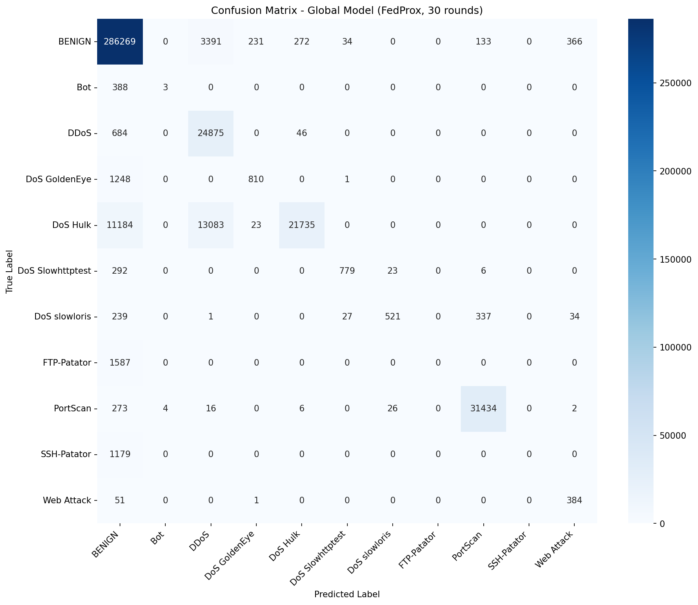

# Federated Learning-Based Network Intrusion Detection System Using ANN on CIC-IDS2017

Implementation of a Federated Learning (FL) IDS using the Flower (flwr) framework with three Non-IID nodes derived from the CIC-IDS2017 dataset. Each node represents a distinct network segment with a different attack distribution. FedProx aggregation is used to mitigate client drift under extreme Non-IID conditions.

**Model:** ANN (256-128-64)  
**Framework:** Flower (flwr) 1.29.0 with Ray backend  
**Aggregation:** FedProx (µ=0.1)  
**Dataset:** CIC-IDS2017 — 11 classes, ~2.01M samples after cleaning

---

## Results

### Global FL Model (FedProx, 30 rounds)

| Metric | Score |
|---|---|
| Accuracy | 94.26% |
| Macro F1 | 0.5471 |
| Weighted F1 | 0.9370 |

### Standalone Baseline Per Node

| Model | Macro F1 | Classes Detected |
|---|---|---|
| Node 1 Standalone | 0.9924 | 3 (local only) |
| Node 2 Standalone | 0.9881 | 5 (local only) |
| Node 3 Standalone | 0.8390 | 5 (local only) |
| Global FL (FedProx) | 0.5471 | 8 (detected) |

### FedAvg vs FedProx

Note: The 0.5735 Macro F1 was obtained from an earlier comparison experiment between FedAvg and FedProx. The current repository implementation and latest notebooks produce a Macro F1 of 0.5471.

| Class | FedAvg F1 | FedProx F1 |
|---|---|---|
| BENIGN | 0.9403 | 0.9728 |
| DDoS | 0.9148 | 0.7993 |
| DoS Hulk | 0.6165 | 0.7817 |
| DoS Slowhttptest | 0.0000 | 0.7947 |
| DoS slowloris | 0.1705 | 0.6001 |
| PortScan | 0.9644 | 0.9865 |
| Web Attack | 0.1197 | 0.6274 |
| **Macro F1** | **0.3548** | **0.5735** |

FedProx improves macro F1 by **61.5%** over FedAvg. The most significant gains are on DoS Slowhttptest and Web Attack, both of which were entirely undetected by FedAvg.

### Confusion Matrix



---

## Non-IID Partitioning

Data is split by collection day, giving each node a naturally distinct attack distribution:

| Node | Source | Dominant Attacks | Rows |
|---|---|---|---|
| 1 | Tuesday | FTP-Patator, SSH-Patator | 445,645 |
| 2 | Wednesday | DoS Hulk, GoldenEye, Slowloris, Slowhttptest | 691,395 |
| 3 | Thursday + Friday | DDoS, PortScan, Web Attack, Bot | 872,949 |

---

## Architecture

```
Aggregation Server (FedProx)
        |
   _____|_____
  |     |     |
Node1 Node2 Node3
(ANN) (ANN) (ANN)
```

Each node trains locally and sends only model weights to the server. Raw data never leaves the node.

**ANN architecture:**

```
Input(68) -> Linear(256) -> ReLU -> Dropout(0.3)
          -> Linear(128) -> ReLU -> Dropout(0.3)
          -> Linear(64)  -> ReLU -> Dropout(0.3)
          -> Output(11)
```

---

## Repository Structure

```
fl-ann-ids-cicids2017/
  notebooks/
    01_explorasi_data.ipynb   # EDA and dataset inspection
    02_model_ann.ipynb        # standalone per-node baseline training
    03_federated.ipynb        # FL training with Flower + FedProx
  models/
    confusion_matrix_global.png
    node1_standalone.pth
    node2_standalone.pth
    node3_standalone.pth
  datasets/                   # not tracked by git (see .gitignore)
    cic-ids2017/              # raw CSVs (~863MB)
    preprocessed/             # per-node .npy splits (~1.08GB)
  README.md
  .gitignore
  requirements.txt
```

---

## Dataset Setup

Download CIC-IDS2017 (MachineLearningCSV format) from the Canadian Institute for Cybersecurity:  
https://www.unb.ca/cic/datasets/ids-2017.html

Place the CSV files under `datasets/cic-ids2017/`:

```
datasets/cic-ids2017/
  Monday-WorkingHours.pcap_ISCX.csv
  Tuesday-WorkingHours.pcap_ISCX.csv
  Wednesday-workingHours.pcap_ISCX.csv
  Thursday-WorkingHours-Morning-WebAttacks.pcap_ISCX.csv
  Thursday-WorkingHours-Afternoon-Infilteration.pcap_ISCX.csv
  Friday-WorkingHours-Morning.pcap_ISCX.csv
  Friday-WorkingHours-Afternoon-DDos.pcap_ISCX.csv
  Friday-WorkingHours-Afternoon-PortScan.pcap_ISCX.csv
```

Then run `01_explorasi_data.ipynb` which handles preprocessing and outputs per-node `.npy` splits to `datasets/preprocessed/`.

---

## Preprocessing

Steps applied in `01_explorasi_data.ipynb`:

- Column name whitespace stripping (`str.strip()`)
- Web Attack variants (Brute Force, XSS, SQL Injection) merged into a single class
- Heartbleed (11 samples) and Infiltration (36 samples) dropped — insufficient for reliable learning
- NaN and Inf values removed (< 0.4% of dataset)
- 10 zero-variance columns dropped; final feature count: **68**
- Label encoding with `LabelEncoder` fitted on union of all node labels
- Per-node `StandardScaler` fitted only on training data to prevent data leakage
- Output: per-node `nodeN_X_train.npy`, `nodeN_X_test.npy`, `nodeN_y_train.npy`, `nodeN_y_test.npy`

Final dataset: **11 classes, ~2.01M samples after cleaning**

---

## Usage

Run the notebooks in order:

**1. `01_explorasi_data.ipynb`**  
EDA and preprocessing. Inspect class distributions, apply cleaning steps, and generate per-node `.npy` splits in `datasets/preprocessed/`.

**2. `02_model_ann.ipynb`**  
Standalone baseline. Trains each node independently for 10 epochs on its local data. Saves `node1_standalone.pth`, `node2_standalone.pth`, `node3_standalone.pth` to `models/`.

**3. `03_federated.ipynb`**  
FL training. Launches the Flower simulation with 3 nodes, FedProx aggregation, and 30 rounds. Evaluates the global model on the combined test set and saves `confusion_matrix_global.png` to `models/`.

---

## Configuration

Key parameters in `03_federated.ipynb`:

| Parameter | Default | Description |
|---|---|---|
| `NUM_NODES` | 3 | Number of FL client nodes |
| `NUM_ROUNDS` | 30 | Federation rounds |
| `LOCAL_EPOCHS` | 1 | Local epochs per node per round |
| `BATCH_SIZE` | 1024 | Training batch size |
| `PROXIMAL_MU` | 0.1 | FedProx proximal coefficient |
| `LR` | 1e-3 | Adam learning rate |

---

## Requirements

```
torch
flwr
ray
pandas
numpy
scikit-learn
matplotlib
seaborn
```

Install:

```
pip install -r requirements.txt
```

---

## Key Findings

- Standalone per-node models achieve macro F1 of 0.8390–0.9924 on local classes but are entirely blind to attack classes from other nodes.
- The global FL model detects 8 of 11 attack classes from a single model — cross-domain generalization that no standalone model can replicate.
- Bot, FTP-Patator, and SSH-Patator score F1=0.0000 in the global model, confirming the **knowledge dilution** phenomenon under extreme Non-IID: discriminative features for node-exclusive minority classes are washed out during weight aggregation.
---

## Hardware

Tested on:

- CPU: AMD Ryzen 7 5700X
- GPU: NVIDIA RTX 3060 Ti (8GB VRAM)
- RAM: 16GB
- OS: Ubuntu 24.04

---

## Academic Context

This repository contains the simulation source code and experimental setup for the mid-term project (UTS) of the Advanced Network Security course. The experimental results generated from this codebase are documented in the following unpublished manuscript:

> Muhamad Wildan Rizky, "Federated Learning-Based Network Intrusion Detection System Using Artificial Neural Network on CIC-IDS2017 Dataset," Master of Electrical Engineering, Telkom University, 2026.

---

## References

The theoretical foundation, dataset, and frameworks used in this simulation are based on the following works:

1. B. McMahan, E. Moore, D. Ramage, S. Hampson, and B. A. y Arcas, "Communication-Efficient Learning of Deep Networks from Decentralized Data," in Proc. 20th Int. Conf. Artificial Intelligence and Statistics (AISTATS), 2017.
2. T. Li, A. K. Sahu, M. Zaheer, M. Sanjabi, A. Smola, and V. Smith, "Federated Optimization in Heterogeneous Networks," in Proc. Machine Learning and Systems (MLSys), 2020.
3. I. Sharafaldin, A. H. Lashkari, and A. A. Ghorbani, "Toward Generating a New Intrusion Detection Dataset and Intrusion Traffic Characterization," in Proc. 4th Int. Conf. Information Systems Security and Privacy (ICISSP), 2018.
4. D. J. Beutel, T. Topal, A. Mathur, X. Qiu, T. Parcollet, P. P. B. de Gusmao, and N. D. Lane, "Flower: A Friendly Federated Learning Research Framework," arXiv preprint arXiv:2007.14390, 2020.
